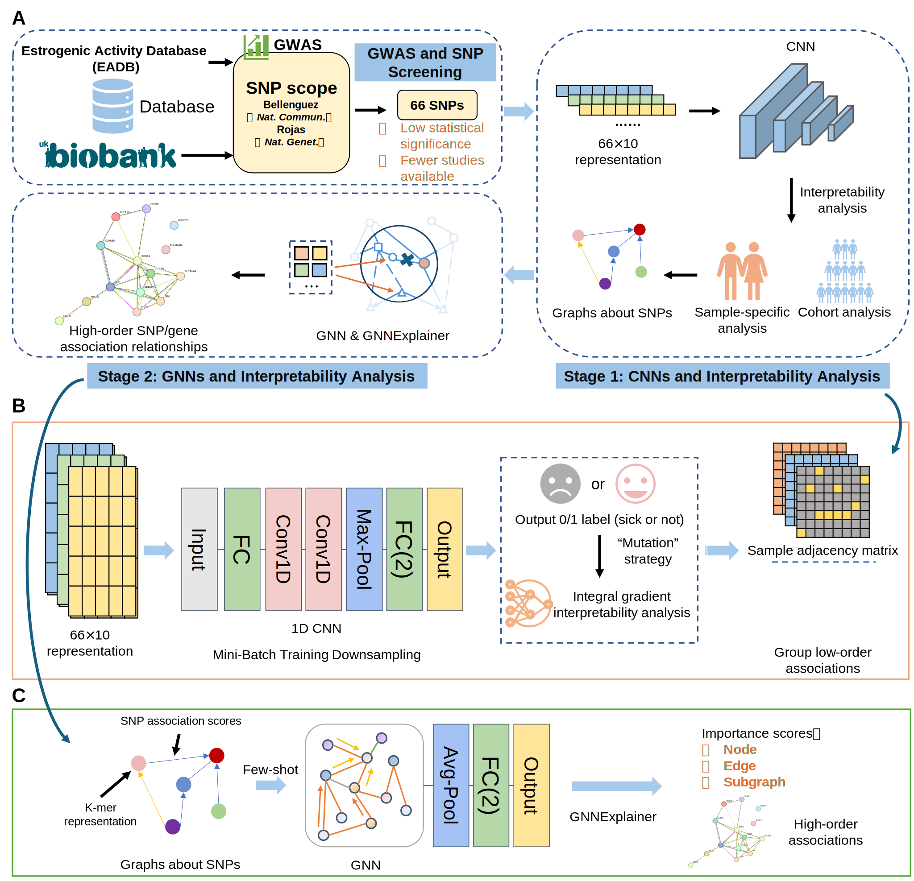

# GENIE: A Two-Stage Interpretable Deep Learning Framework for Revealing the High-Order Genetic Interaction Network of Alzheimer's Disease

## Overview

GENIE is a two-stage interpretable deep learning framework designed to reveal high-order genetic interaction networks associated with Alzheimer's Disease. This repository contains the implementation of the GENIE framework, including data processing, model training, and network interpretation modules.

## Main Architecture



## Data Sources

The individual-level genetic and phenotypic data used in this study were obtained from the UK Biobank ([https://www.ukbiobank.ac.uk/](https://www.ukbiobank.ac.uk/)) under Application Number 54520. The lists of SNPs used for analysis are `data/snps_oxford`.

## Installation

1. Clone the repository:

```bash
git clone https://github.com/GufengYu520/GENIE.git
cd GENIE
```

2. Create and activate the conda environment:

```bash
conda env create -f environment.yml
conda activate genie
```

## Usage

### 1. Data Preparation

First, prepare your data in the appropriate format and place it in the `data/` directory.

### 2. Model Training

#### Classifier Training

```bash
python main_classifier.py
```

#### GNN Model Training

```bash
python main_GNN.py --model_type gcn --kmer 7mer_50 --threshold_attr 0.3
```


### 3. Model Explanation


#### Attribution Calculation
```bash
python main_Attr.py
```

#### GNN Explanation
```bash
python main_Explain.py
```


### 4. Statistical Analysis

```bash
python main_statistic.py
```

## Key Components

### 1. Model Architecture

- **First Stage**: Attribution-based interpretation to identify important genetic interactions
- **Second Stage**: GNN-based classifier to capture complex genetic interactions

### 2. Interpretation Methods

- **Integrated Gradients**: For calculating feature importance
- **GNNExplainer**: For explaining graph neural network predictions
- **Statistical Analysis**: For validating identified interactions


## License

This project is licensed under the MIT License - see the LICENSE file for details.

## Contact

For questions or issues, please contact [jm5820zz@sjtu.edu.cn](mailto:jm5820zz@sjtu.edu.cn).
